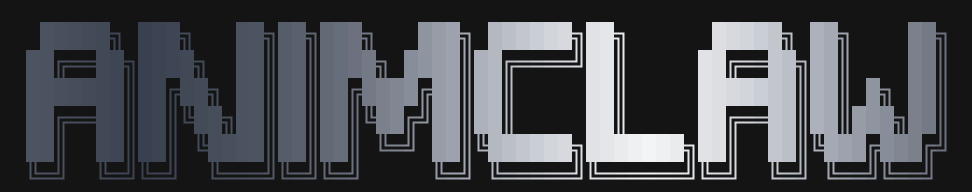

<p align="center">
  <a href="https://animclaw.com">
    
  </a>
</p>

<p align="center">
  <a href="https://www.npmjs.com/package/animclaw"></a>&nbsp;
  <a href="LICENSE"></a>
</p>

<p align="center">
  <a href="https://animclaw.com">Website</a> · <a href="https://floweralicee.github.io/lipsync-ai-demo/paper.html">Research Paper</a> · <a href="https://github.com/floweralicee/animclaw">GitHub</a>
</p>

<br />

<p align="center">
  <a href="https://animclaw.com">
    
  </a>
</p>

<br />

> **Anyone can make a film.** The one-stop shop for filmmakers — pre-production to post, Animclaw handles it all.

---

## What is Animclaw?

Animclaw is a local-first AI film production tool. Describe what you need in plain English — Animclaw acts as your entire crew: director, writer, producer, line producer, storyboard artist, and VFX artist. One command launches everything at `localhost:4200`.

```bash
npx animclaw
```

---

## One prompt for anything

Type what you need. Animclaw handles the rest — whether it's building a shot list, generating character art, writing a scene breakdown, or assembling your entire pre-production package.

| Prompt | Result |
|---|---|
| `"Write a shot list for my horror short"` | 24 shots generated, sorted by scene |
| `"Create a character bible for Maya"` | Backstory, visual ref, personality traits |
| `"Break down scene 3 for the crew"` | Call sheet, props, lighting notes |

---

## Drop your project folder

Drop your project folder — scripts, references, notes — and ask `"prepare my pre-production"`. Animclaw generates your full pre-production package in seconds.

| Deliverable | Contents |
|---|---|
| **Story Bible** | Characters, locations, world rules, style guide |
| **Task Board** | Per-department tasks & deliverables |
| **Skill Sheet** | Roles, tools, hiring checklist |
| **Production Tracker** | Shots, status, dependencies at a glance |

---

## Performances that feel human

Most AI video looks robotic because motion is evenly timed. Animclaw uses **prosody analysis** — identifying stressed words, beat boundaries, and hold windows — to generate animation that follows how real actors perform.

Based on *"Prompt-Level Controls for Prosody-Aligned Facial Performance"* (Chen, 2025) and the principles of Thomas & Johnston and Williams.

→ [Read the paper](https://floweralicee.github.io/lipsync-ai-demo/paper.html)

---

## Workflow

```
01 Imagine   →   Characters, worlds, storyboards
02 Plan      →   Story bible, shot list, schedule
03 Create    →   AI characters, animation, VFX
04 Wrap      →   Export & share your film
```

---

## Install

**Node 22+ required.**

```bash
npx animclaw
```

Opens at `localhost:4200` after completing onboarding wizard.

---

## Commands

```bash
npx animclaw          # runs onboarding again for openclaw --profile animclaw
npx animclaw update   # updates animclaw with current settings as is
npx animclaw restart  # restarts animclaw web server
npx animclaw start    # starts animclaw web server
npx animclaw stop     # stops animclaw web server

# some examples
openclaw --profile animclaw <any openclaw command>
openclaw --profile animclaw gateway restart

openclaw --profile animclaw config set gateway.port 20001
openclaw --profile animclaw gateway install --force --port 20001
openclaw --profile animclaw gateway restart
openclaw --profile animclaw uninstall
```

---

## Development

```bash
git clone https://github.com/AnimClaw/AnimClaw.git
cd animclaw

pnpm install
pnpm build

pnpm dev
```

Web UI development:

```bash
pnpm install
pnpm web:dev
```

---

## Open Source

MIT Licensed. Fork it, extend it, make it yours.

<p align="center">
  <a href="https://star-history.com/?repos=AnimClaw%2FAnimClaw&type=date&legend=top-left">
    
  </a>
</p>

<p align="center">
  <a href="https://github.com/AnimClaw/AnimClaw"></a>
</p>
